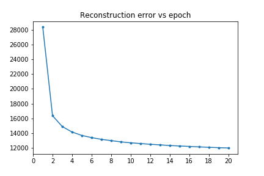
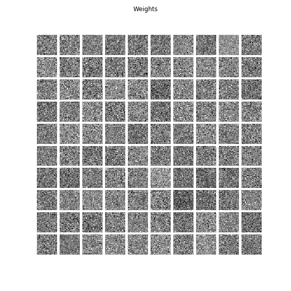

# Restricted-Boltzmann-Machine

 Python implementation of Restricted Boltzmann Machine (RBM). And an example on MNIST dataset.
 Implementation code is in [RBM.py](RBM.py) and it's use for MNIST data is in the notebook [rbm_mnist_example.ipynb](rbm_mnist_example.ipynb).

 RBM code is very well documented for using it for your data.

 ## Requirements
 - Numpy
 - Scipy
 - Matplotlib (for MNIST example)
 - time (for MNIST example)
 - struct (for MNIST example)

 ## Results on MNIST
 - 100 Hidden units

 - Error plot for 20 epochs

	

	  
	

 - Reconstruction of few selected images as the model gets trained

    

	  
	

 - Learned weights of the RBM over time

    

	  
	

 ## Todo
 - Block Gibbs sampling.
 - Persistent Contrastive Divergence
 - Fast PCD

 ## References
 [1] [An Introduction to Restricted Boltzmann Machines - Asja Fischer and Christian Igel](https://link.springer.com/chapter/10.1007/978-3-642-33275-3_2) 
 [2] [Training Restricted Boltzmann Machines: An Introduction - Asja Fischer and Christian Igel](https://christian-igel.github.io/paper/TRBMAI.pdf) 
 [3] [A Practical Guide to Training Restricted Boltzmann Machines - Geoffrey Hinton](https://www.cs.toronto.edu/~hinton/absps/guideTR.pdf) 